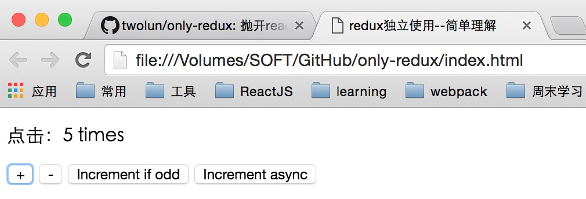

# only-redux
抛开react/webpack/es6，来单独的学习理解redux，我想会更容易理解一点；对于那些还在对redux感到迷惑的同学，应该回过头来看点简单的东西了。。。


### 让我们以最简单的方式开始

直接将html页面在浏览器打开，简单到我们不启任务web服务了，  
   


### 定义constant，与react中我们定义的constant对应
```javascript
var INCREMENT = 'INCREMENT';
var DECREMENT = 'DECREMENT';
```

### 定义actionCreator，与react中定义的actionCreator对应
- 首先是两个返回纯对象的action，也是没有任何副作用的action
```javascript
function increment(){
	return {
		type: INCREMENT
	}
}

function decrement(){
	return {
		type: DECREMENT
	}
}
```

- 还有两个异步action，也叫带有副作用的action，异步函数用的最多其实也就是ajax请求了
```javascript
function incrementIfOdd(){
	return function(dispatch, getState){
		if(getState() % 2 !== 0){
			dispatch(increment())
		}
	}
}

function incremnetAsync(){
	return function(dispatch, getState){
		setTimeout(function(){
			dispatch(increment())
		}, 1000);
	}
}

```

### 定义reducer，与react中定义的reducer对应
```javascript
function counter(state, action){
	switch(action.type) {
		case 'INCREMENT':
			return state + 1;
			break;
		case 'DECREMENT':
			return state - 1;
			break;

		default:
			return state;
	}
}

```

### 现在开始创建store，
	如果我们只简单的用Redux.createStore来创建，已经不能满足我们的需求了，  
	我们像react中那样使用redux-thunk中间件，而实际上这是个什么玩意呢？？？

我们直接查看redux-thunk模块的npm包源码，仅仅是下面的代码而已
```javascript
'use strict';

exports.__esModule = true;
exports['default'] = thunkMiddleware;

function thunkMiddleware(_ref) {
  var dispatch = _ref.dispatch;
  var getState = _ref.getState;

  return function (next) {
    return function (action) {
      return typeof action === 'function' ? action(dispatch, getState) : next(action);
    };
  };
}

module.exports = exports['default'];
```
`redux-thunk`模块仅仅是一个高阶的函数而，就是我们的action进行了一次封装，  
那我们可以把这个高阶函数拿出来用到我们的项目中

```javascript
function thunkMiddleware(_ref) {
  	var dispatch = _ref.dispatch;
  	var getState = _ref.getState;

  	return function (next) {
    	return function (action) {
      		return typeof action === 'function' ? action(dispatch, getState) : next(action);
    	};
  	};
}

//通过Redux.applyMiddleware创建store
var createStoreWithMiddleware = Redux.applyMiddleware(thunkMiddleware)(Redux.createStore);
var store = createStoreWithMiddleware(counter);

//这个时候我们就可以dispatch异步action了

```

### 定义render函数
```javascript
var valueEl = document.getElementById('value');
function render(){
	valueEl.innerHTML = store.getState();
}

//初始化执行一次
render();

```

### 订阅监听action，每次dispatch，render都会执行
```javascript
store.subscribe(render);

```
```javascript
document.getElementById('increment')
	.addEventListener('click', function(){
		store.dispatch(increment())
	});

document.getElementById('decrement')
	.addEventListener('click', function(){
		store.dispatch(decrement())
	});

document.getElementById('incrementIfOdd')
	.addEventListener('click', function(){
		store.dispatch(incrementIfOdd())
	});

document.getElementById('incremnetAsync')
		.addEventListener('click', function(){
			store.dispatch(incremnetAsync())
		});
```

具体的代码中用的redux相关api没有详细说明，因为都很多了，[可以参考这篇文章](http://cn.redux.js.org/docs/api/Store.html)


